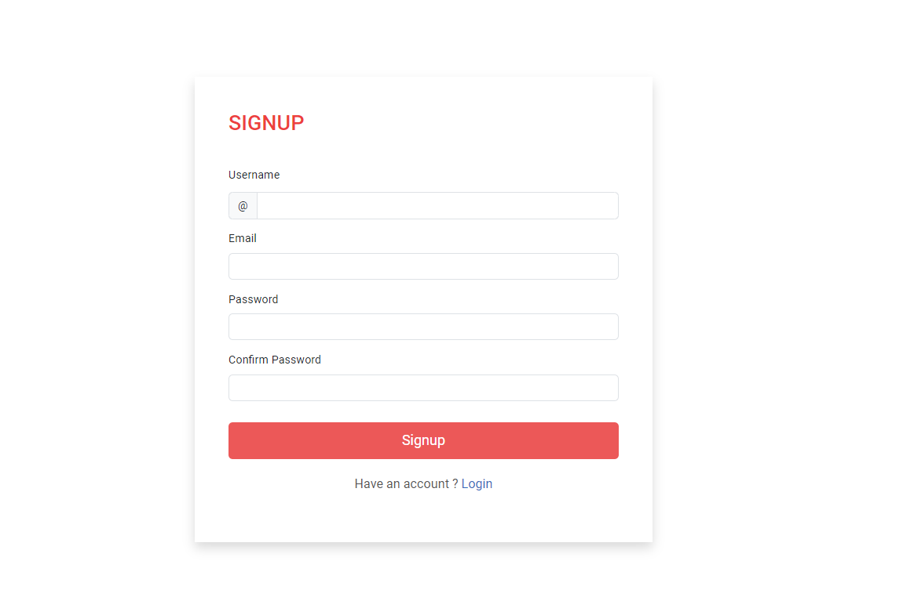

  <h1 align="center">Python Django Blog Website</h1>

A Blog application in Django contains all the features of a Blog site like login/register into the system, add blog post with title, description and image and edit or delete the blog post.

 

## 📃 Description

Creating A Blog In Django has interactive UI design using which users can see what others are posting. It also has an admin panel through which all the blog posts and users can be managed.

 
 

 

## Features 

- **Manage Blog** :– In this feature includes the CRUD operation in a blog or content you create like adding, editing and deleting content of the blog
- **Login System** :- In this feature the admin can login to the system and manage all the feature of the system.
- **Blog** :- In this method which is the main method of the system.
- **Media** :- In this method which you can found all the media that you are upload in the system.
- **Template** :- In this method which is the design of the system that consist of HTML,CSS and JavaScript.

## 🛠 Built With

* HTML
* CSS
* JAVASCRIPT
* PYTHON
* DJANGO
* DATABASE 

The system is built fully in Django Framework in back-end and HTML, CSS in front-end. It has full-featured user interface with all the functionalities

Run

python manage.py runserver

open it in Local server http://127.0.0.1:8000/

